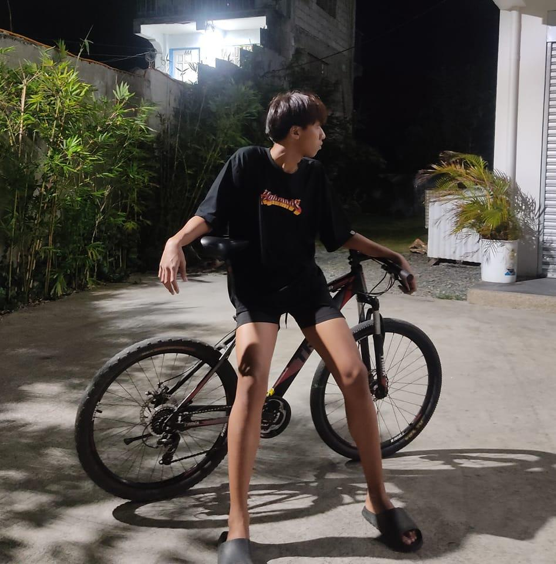
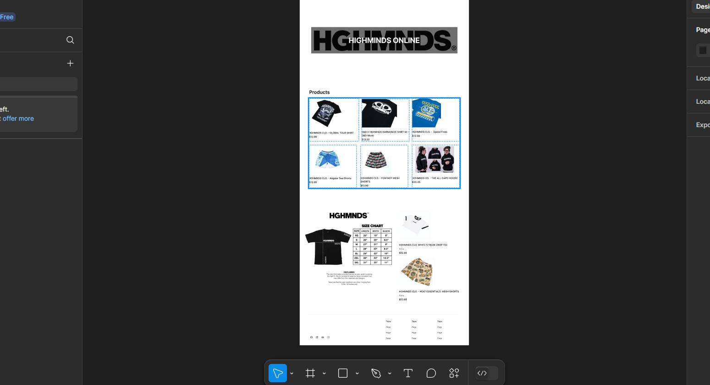

# My Portfolio

### About
Hi, Im Leonardo, an IT student with a passion for technology and problem-solving. I’m currently diving deep into the world of mention specific areas you're focusing on, like software development, networking, cybersecurity, data science, etc. Whether it’s coding, building systems, or troubleshooting complex tech issues, Im always eager to learn and apply new skills.

### Projects

### Hobbies
- Online Gmaes
- bond with my friends

### Favorite Subject
- PlatTech
- Elective

### School
- Philippine Christian University

### BirthDate
05/06/2003

### Contact
- Leonardo Sarte
- bushpogi135@gmail.com
- 09297535219
